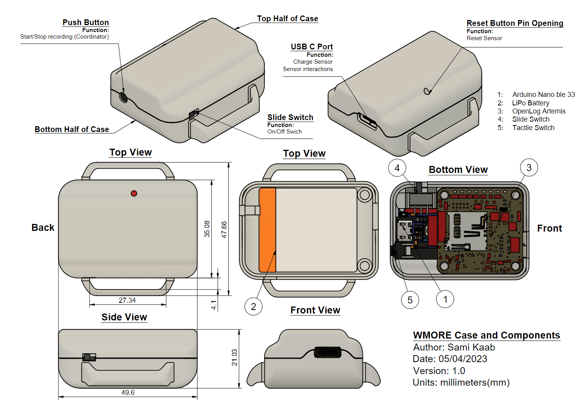

<a name="readme-top"></a>

# **WMORE: an open-source wearable system for synchronous movement recording**
<p align="center">


</p>


This project aims at providing an opensource platform for synchronised inertial measurements.

The project comprises two types of sensors: a Logger and a Coordinator. The Coordinator is responsible for starting and stopping the recording on the Loggers while ensuring that they remain synchronized. Only one Coordinator is required to operate a group of Loggers.

This document provide information on the components needed to build the WMOREs, how to program, assemble and use them.

---
- [**WMORE: an open-source wearable system for synchronous movement recording**](#wmore-an-open-source-wearable-system-for-synchronous-movement-recording)
- [**Set Up**](#set-up)
  - [**Development Container Setup**](#development-container-setup)
  - [**Required Components**](#required-components)
  - [**Firmware**](#firmware)
    - [**Openlog Artemis (OLA)**](#openlog-artemis-ola)
      - [**Setting up the Arduino environment**](#setting-up-the-arduino-environment)
      - [**Building and Uploading Firmware**](#building-and-uploading-firmware)
    - [**Nano**](#nano)
      - [**Building the Zephyr Project** (for developpers)](#building-the-zephyr-project-for-developpers)
      - [**Uploading Firmware to Nano**](#uploading-firmware-to-nano)
  - [**Hardware**](#hardware)
    - [**Soldering The Components**](#soldering-the-components)
    - [**Assembling The Case**](#assembling-the-case)
  - [**Software**](#software)
- [**Using the WMOREs**](#using-the-wmores)
  - [**Recording**](#recording)
  - [**WMORE Settings**](#wmore-settings)
  - [**WMORE LED Colour Code**](#wmore-led-colour-code)
- [TODO](#todo)
  - [Bugfixes](#bugfixes)
  - [Features](#features)
  - [Clean ups](#clean-ups)
- [License](#license)

# **Set Up**
Required/useful skills to have:
* 3D printing experience
* CAD modeling (only if planning on modifying or redesigning the case)
* Soldering
* SMD soldering
* Programming experience in C,C++, Arduino, and/or Python (only if planning on modifying firmware or software components of the project)

## **Development Container Setup**
---
This project uses a development container to provide a consistent development environment. The container includes all necessary tools and dependencies for building and uploading firmware.

### Prerequisites
- [Docker](https://www.docker.com/products/docker-desktop/)
- [Visual Studio Code](https://code.visualstudio.com/)
- [VS Code Remote - Containers extension](https://marketplace.visualstudio.com/items?itemName=ms-vscode-remote.remote-containers)

### Setup Steps
1. Clone this repository
2. Open the project in VS Code
3. When prompted, click "Reopen in Container" or use the command palette (F1) and select "Remote-Containers: Reopen in Container"
4. Wait for the container to build and start

The container includes:
- Arduino CLI
- All required Arduino libraries (automatically installed)
  - SparkFun 9DoF IMU Breakout - ICM 20948 (v1.2.12)
  - SdFat (v2.2.3)
  - AmbiqSuiteSDK
- SparkFun Apollo3 board support (v2.2.1)
- BOSSA for flashing Arduino Nano
- All necessary build tools

**Note:** When using the dev container, you do not need to manually install any libraries or board support packages - everything is pre-configured.

## **Required Components**
The WMOREs were designed using the list of components below. Only the Arduino Nano and Artemis Openlog are required to run the firmware, the battery and switches can be swapped for different models. However the CAD models for the case will need to be modified or redesigned accordingly if you choose to do so. At least 2 WMOREs must be assembled:

 * [Arduino Nano ble 33 (Sense)](https://store.arduino.cc/products/arduino-nano-33-ble-sense)
 * [SparkFun OpenLog Artemis](https://www.sparkfun.com/products/16832) (OLA)
 * [Slide switch](https://www.digikey.com.au/en/products/detail/c-k/OS102011MS2QN1/411602)
 * [Tactile Switch](https://www.digikey.com.au/en/products/detail/te-connectivity-alcoswitch-switches/1825910-6/1632536)
 * [LiPo Battery 500mAh 3.7V 503035](https://ecocell.com.au/product/lipo-500-503035/)
 * 500 mm of 30 AWG hook up wire
 * A [4.7kΩ 0402 surface mount resistor](https://www.digikey.com.au/en/products/detail/panasonic-electronic-components/ERA-2AEB472X/1706021)
 * A MicroSDXC V30 U3 C10 A2
 * Sim card tray pin (for pressing the reset button)
 * USB type A to USB type C cable (for the open log)
 * USB type A to micro-USB cable (for the arduino nano)
  
In addition to this component access to the following is required:
* 3D printing equipment and filament (we used PLA)
* Soldering Iron
* Soldering Microscope (for replacing the SMD resistor, see section below)
  

**It is recommended to flash the Arduino Nano's and OLA's firmware before soldering and assembling the components into the case as this makes testing and debugging easier. It's especially important to do so for the Arduino Nano as once the case is closed the Nano's micro USB port is no longer accessible.**


## **Firmware**
### **Openlog Artemis (OLA)**
---
The Coordinator and Logger OLA firmware applications are based on v2.3 of the Openlog Artemis application supplied by Sparkfun (https://github.com/sparkfun/OpenLog_Artemis). Both the OLA firmware applications were developed using the Openlog Artemis board support package installed on version 1.8.12 of the Arduino IDE. 

The Coordinator and Logger OLA firmware applications are predominantly written in Arduino C++, but include calls to the AmbiqSuiteSDK (mirrored by Sparkfun at https://github.com/sparkfun/AmbiqSuiteSDK). The original Openlog Artemis application has been significantly modified for the WMORE to enable synchronisation and to reduce processing delays. Some of the original functionality has been lost as a result. 

The Arduino project for the OLA can be found in the [WMORE_Openlog_Logger](Firmware/WMORE_Openlog_Logger) and [WMORE_Openlog_Coordinator](/Firmware/WMORE_Openlog_Coordinator/) folders under [Firmware](/Firmware/). 

<p align="right">(<a href="#readme-top">back to top</a>)</p>

#### **Setting up the Arduino environment**
---
**Recommended: Using the Development Container**

If you are using the development container (see [Development Container Setup](#development-container-setup) above), all Arduino libraries and board support packages are automatically installed. You can skip to the [Building and Uploading Firmware](#building-and-uploading-firmware) section.

**Alternative: Manual Setup (Without Dev Container)**

If you prefer not to use the development container, you can manually set up the Arduino environment:

- Install Arduino IDE 1.8.12 or above from: https://www.arduino.cc/en/software#future-version-of-the-arduino-ide
- Add SparkFun URL to preferences by following the guide here: https://learn.sparkfun.com/tutorials/artemis-development-with-arduino#arduino-installation
- Install Board Support for SparkFun Apollo3 Artemis (v2.2.1) using Board Manager
- Select Redboard Artemis ATP
- Install required libraries using Library Manager:
  - SparkFun 9DoF IMU Breakout - ICM 20948 (v1.2.12)
  - SdFat (v2.2.3 or v2.2.x)

**Note:** The firmware includes references to many additional sensor libraries that are currently unused. These will be removed in a future cleanup (see [TODO](#todo)).


<p align="right">(<a href="#readme-top">back to top</a>)</p>

#### **Building and Uploading Firmware**
---
**Using the Development Container (Recommended)**

The development container includes Arduino CLI pre-configured with all dependencies. Use these commands to build and upload firmware:

1. To build the Logger firmware:
```bash
arduino-cli compile -v --fqbn SparkFun:apollo3:sfe_artemis_atp --output-dir ./Firmware/WMORE_Openlog_Logger/build Firmware/WMORE_Openlog_Logger/WMORE_Openlog_Logger.ino
```

2. To build the Coordinator firmware:
```bash
arduino-cli compile -v --fqbn SparkFun:apollo3:sfe_artemis_atp --output-dir ./Firmware/WMORE_Openlog_Coordinator/build Firmware/WMORE_Openlog_Coordinator/WMORE_Openlog_Coordinator.ino
```

3. To upload the firmware (replace COM_PORT with your device's port):
```bash
# For Logger
# This will both recompile and upload the firmware
arduino-cli upload -v -p COM_PORT --fqbn SparkFun:apollo3:sfe_artemis_atp Firmware/WMORE_Openlog_Logger/WMORE_Openlog_Logger.ino

# To upload without recompiling, use the .bin file directly:
arduino-cli upload -v -p COM_PORT --fqbn SparkFun:apollo3:sfe_artemis_atp --input-file ./Firmware/WMORE_Openlog_Logger/build/WMORE_Openlog_Logger.ino.bin

# For Coordinator
arduino-cli upload -v -p COM_PORT --fqbn SparkFun:apollo3:sfe_artemis_atp Firmware/WMORE_Openlog_Coordinator/WMORE_Openlog_Coordinator.ino

# To upload without recompiling, use the .bin file directly:
arduino-cli upload -v -p COM_PORT --fqbn SparkFun:apollo3:sfe_artemis_atp --input-file ./Firmware/WMORE_Openlog_Coordinator/build/WMORE_Openlog_Coordinator.ino.bin

```

To find your device's port:
```bash
arduino-cli board list
```

**Alternative: Using Arduino IDE**

If you set up the environment manually without the dev container, you can use the Arduino IDE:
1. Open the `.ino` file in Arduino IDE
2. Select **Tools > Board > SparkFun Apollo3 > RedBoard Artemis ATP**
3. Select the correct port under **Tools > Port**
4. Click **Upload**

<p align="right">(<a href="#readme-top">back to top</a>)</p>

### **Nano**
---
The Coordinator and Logger Nano applications are written using **v2.1.0** of the **Nordic Semiconductor nRF Connect SDK** in the **Visual Studio Code** IDE and based on the nRF Connect SDK Enhanced Shockburst sample (**ESB ptx**) applications. The nRF Connect SDK is based on the Zephyr RTOS, and Zephyr API calls are used in the WMORE applications. 

It is only necessary to install the nRF Connect SDK if you intend to modify this project. If that is the case, this link is a good starting point: [https://www.nordicsemi.com/Products/Development-software/nrf-connect-sdk]. The Documentation, Get Started, and nRF Connect Fundamentals links are particularly useful: 
[https://developer.nordicsemi.com/nRF_Connect_SDK/doc/latest/nrf/introduction.html]
[https://www.nordicsemi.com/Products/Development-software/nRF-Connect-SDK/GetStarted#infotabs]
[https://academy.nordicsemi.com/courses/nrf-connect-sdk-fundamentals/].

The nRF Connect SDK and the Zephyr RTOS involve a fairly complex structure of files and dependencies. Fully documenting this is well beyond the scope of this document. Of particular note however are several `.overlay`, `.dts`, and `.conf` files that are used to set up or check project-specific peripherals and pin mappings. For instance:

`<path_to_project>\<project_name>\boards\arduino_nano_33_ble.overlay` sets UART speed and GPIO pin mappings for the Nanos.

`<path_to_project>\<project_name>\arduino_nano_33_ble\zephyr\zephyr.dts` is a system-generated file that allows many peripheral settings to be checked.

`<path_to_project>\<project_name>\prj.conf` is a configuration file that is sometimes relevant when adding new peripherals.

<p align="right">(<a href="#readme-top">back to top</a>)</p>

#### **Building the Zephyr Project** (for developpers)
---
1. Install nRF Connect SDK v2.1.0 by following [this tutorial](https://www.nordicsemi.com/Products/Development-software/nRF-Connect-SDK/GetStarted#infotabs)
2. In the NRf connect SDK extension in VS code click on the Create a new Aplication button
3. Select Workspace as application type
4. Select Toolcahin Version 2.1.0 
5. Select Sample `nrf/samples/esb/prx` for the Logger or `nrf/samples/esb/ptx` for the Coordinator
6. Replace the `source/main.c` file with [Firmware/Nano_Coordinator/src/main.c](/Firmware/Nano_Coordinator/src/main.c) or [Firmware/Nano_Logger/src/main.c](/Firmware/Nano_Logger/src/main.c)
7. replace the `prj.conf` file with [Firmware/Nano_Coordinator/prj.conf](/Firmware/Nano_Coordinator/prj.conf) or [Firmware/Nano_Logger/prj.conf](/Firmware/Nano_Logger/prj.conf)
8. Add the [overlay](/Firmware/Nano_Coordinator/boards/arduino_nano_33_ble.overlay) file to the project
9. Click on the `Add Build Configuration` button next to the application you just created under the Applications tab in the NRf Connect extension
10. Select `All Boards` under `Board` and search for `arduino_nano_ble_sense`
11. Click build configuration.

<!-- 
the steps regarding the setup of the nrf sdk in vscode can be made clearer if some screenshots are attached 
-->
    
You should now be able to build the project. You can follow the steps in the next sessions to flash the Nano with the generated `.bin` file. The `.bin` have been rename `coordinator.bin` and `logger.bin` in the following section for more clarity however they can be found here: `<path_to_project>\<build_folder>\zephyr\zephyr.bin`.

<p align="right">(<a href="#readme-top">back to top</a>)</p>

#### **Uploading Firmware to Nano**
---

In order to flash the firmware to the Arduino nano, it is also necessary to install the [Bossa](https://www.shumatech.com/web/products/bossa) utility. An easy way to do this is to install the Arduino IDE and add the arduino nano 33 ble (sense) to the board manager.

- Connect the Nano to the computer and press the white tactile button twice (the orange LED should start flashing)

- Identify the path to the `coordinator.bin` or `logger.bin` file which can be found at :
  - For the Logger: [<path_to_project>/Firmware/Nano_Logger/logger.bin](Firmware/Nano_Logger/logger.bin)
  - For the Coordinator: [<path_to_project>/Firmware/Nano_Coordinator/coordinator.bin)](Firmware/Nano_Coordinator/coordinator.bin)
  - If you have built the project yourself: `<path_to_project>\<build_folder>\zephyr\zephyr.bin`

- Open a terminal window (search cmd) in the folder where bossac.exe is located, which should be of the form: `C:\Users\<user_name>\AppData\Local\Arduino15\packages\arduino\tools\bossac\1.9.1-arduino2`

- Enter the following command line for the Coordinator: 
  ```sh
  .\bossac -d --port=COM<xx> -U -i -e -w <path_to_project>/Firmware/Nano_Coordinator/coordinator.bin -R
  ```
  and for the Logger:
  ```sh
  .\bossac -d --port=COM<xx> -U -i -e -w <path_to_project>/Firmware/Nano_Logger/logger.bin -R
  ```
  
**NOTE** : The appropriate .bin file **<path_to_project>** and **\<xx\>** should be substituted. The com port number can be found using the Device Manager. 

<p align="right">(<a href="#readme-top">back to top</a>)</p>


## **Hardware**


### **Soldering The Components**
---
Before wiring the components together, the OLA must be modified in 2 ways:
1. The JST connector needs to be removed, in order for the Openlog to fit in the case. The battery will directly be wired to the pins underneath it. To do so, disconnect the two surface mount pins of the JST connector (see [Figure 1](/Documentation/OpenLog_JST_Desolder_Location.jpg)) by cutting them off of the PCB using flush cutters, then slide the JST connector off of its rails by pushing it away from the border of the PCB. The OLA should now look like the picture in [Figure 2](/Documentation/OpenLog_JST_Desoldered.jpg).

2. The OLA has a charge current of approximately 450 mA. The 500 mAh Ecocell 503035P that is used in the WMOREs has a recommended charge current of 100 mA. If this battery is used then the OLA charge current must be reduced to 100 mA for safe operation. To achieve this, desolder the R4 resistor (which location is shown in [Figure 3.](/Documentation/Openlog_Battery_Voltage_Regulator_Resistor.jpg)) and replace it with a 4.7kΩ 0402 surface mount resistor.

|  |  |  |
|-|-|-|
| [Figure 1.](Documentation/OpenLog_JST_Desolder_Location.jpg) JST pins to desolder | [Figure 2.](Documentation/OpenLog_JST_Desoldered.jpg) Desoldered JST connector | [Figure 3.](Documentation/Openlog_Battery_Voltage_Regulator_Resistor.jpg) Location of the resistor to change |

The male JST connector on the battery also needs to be cut off.

Use the wiring diagram below to solder the components together.  
The wire lengths are only recommendations. However, the wires need to be long enough to reach the components but short enough to fit in the case. 


</br>
[Figure 4.](Documentation/WMORE_wiring_diagram.png) WMORE Logger and Coordinator wiring Diagram 

At this stage if you have soldered a Coordinator and Logger it is a good idea to test them before putting the components in the case. To do so follow the steps outlined in the [Using the WMOREs](#Using_the_WMOREs) section.

<p align="right">(<a href="#readme-top">back to top</a>)</p>

### **Assembling The Case**
---
Before assembling the case, 3D print the models in [WMORE_Bottom.obj](Documentation/CAD_Models/WMORE_Bottom.obj) and [WMORE_Top.obj](/Documentation/CAD_Models/WMORE_Top.obj). the Case is identical for the Coordinator and Logger. It is recommended to use a semi-see-through material when 3D printing the case so that the led's are visible from the outside.
Once printed and all the components soldered place them in to the case as follows:  

**MAKE SURE THE SLIDE SWITCH IS IN THE OFF POSITION WHILE ASSEMBLING!**
1. Place the Arduino Nano inside the top half of the case (see [Figure 5](Documentation/Case_Mechanical_Drawing.png)) with the micro usb port facing the back.
2. Place the Push Button and Slide Switch in their respective frames  
   Make sure that the two soldered pin of the Slide Switch are towards the front. This is an arbitrary direction so that turning on the sensor is consistenly done by sliding the switch forward.
3. Place the OLA on the supporting pegs of the top half of the case with the USB C port flush against the opening.
4. Place the SD card into the SD card slot of the OLA (for the Loggers only).
5. Place the Battery inside the bottom half of the case.
6. Join the two halves of the case.  
   Make sure the Battery cables are not stuck between the OLA SD card slot and the Battery.

<!--
clearly illustrate how components are to be fitted together, include some screenshots of the title animation and recommended order of steps for assembly
-->

</br>
[Figure 5.](Documentation/CAD_Models/Case_Mechanical_Drawing.png) WMORE Logger and Coordinator wiring Diagram 

<p align="right">(<a href="#readme-top">back to top</a>)</p>

## **Software**

All interections with the WMOREs can be done through a serial monitor such as [PuTTY](https://www.chiark.greenend.org.uk/~sgtatham/putty/) or [Tera Term](http://www.teraterm.org/). However, for convenience, a python program was written to simplify some of the repetitive tasks. The source code is available in the [Software](/Software/) folder. This code can be run either from python or using the executable.

If you wish to modify the code follow these steps:
* Install [Python](https://www.python.org/downloads/) (tested with versin 3.9.16) and don't forget to tick the `Add Python 3.x to PATH` box
* (Optional) Create and activate your environment
* Open a terminal in the [Software](/Software/) folder and run:
    ```sh
    pip install -r requirement.txt
    ```

* Run [WMORE_HUB.pyw](/Software/WMORE_HUB.pyw) from a code editor like VS Code

Otherwise download and extract [WMORE.zip](/Software/WMORE.zip) and run `WMORE_HUB.exe`.


You also **need** to install [Tera Term](http://www.teraterm.org/) in order to download the data off of the WMOREs. The program may take a minute or two the first time you run it as it is searching for the location of Tera Term on your computer.


<p align="right">(<a href="#readme-top">back to top</a>)</p>

<!--
Add spec file or documented command for converting the project to an exe file or create an exe file and make it avialable
-->
# **Using the WMOREs**<a id="Using_the_WMOREs"></a>
Once you have assemble at least one Coordinator and Logger connect them to a computer. Launch WMORE_HUB. 

As explained before all interactions with the WMOREs can be done through a serial monitor. However, the program allows the user to automate some of the more repetitive and complex tasks such as:
* Finding the WMOREs' com port and connecting to a WMORE
* Setting the Real Time Clock (RTC) on the Coordinator
* Formatting the SD card on the Loggers
* Downloading the data off of the Loggers
* Converting the data from `.bin` to `.csv` (can only be done using WMORE_HUB or see [BinToCSV.py](/Software/BinToCSV.py))

<!--
make clear what the units are for the measurements and what time data corresponds to the RTC
-->


<p align="right">(<a href="#readme-top">back to top</a>)</p>

## **Recording**

The step for recording from the WMOREs are as follow:

1. Turn the Logger(s) and the Coordinator on using the slide switch on the side of the sensor
2. Reset the sensor using a sim card tray pin (or push button for Loggers)
3. Connect the sensors to your computer
4. (Optional) Set the ID on the Logger(s) and Coordinator using the serial monitor (see the `"WMORE Settings"` section below)
5. Format the SD card on the Logger(s)
6. Unplug the Logger(s), power cycle it/them (reset before turning)
7. Set the RTC on the Coordinator
8. Unplug the Coordinator and reset it using the sim card tray pin **DO NOT SWITCH IT OFF!**
9. Reset the Logger(s)
10. Press the push button on the Coordinator to start recording. The LEDs should turn from solid red to solid blue (see the `"WMORE LED colour code"` section below)
    
<!--
let users know that sd card warning on the co-ordinator is normal

remind users that only logger requires an sd card not the coordinator
-->

Keep the Loggers within a meter of the Coordinator through out the recording. A recording must last at least 1 minute for synchronisation to be effective.

10.  Press the push button on the Coordinator to stop recording. The LEDs should turn from solid blue to solid red
11.  Connect the Logger(s) to the computer
12. Download the data off of the loggers
13. Turn off WMOREs (it's a good idea to reset them too after they are off)
14. Delete empty files (bin file with 0kB)
15. Convert the data from `.bin` to `.csv`

Here is a short tutorial video showing the steps above: 
 
[](https://www.youtube.com/watch?v=zHUC899wjb8)

<!-- [](/Documentation/WMORE_Hub_Tutorial.mp4) -->


<p align="right">(<a href="#readme-top">back to top</a>)</p>

## **WMORE Settings**

There are some note worthy settings that are only accessible via the serial monitor:
* Configure Terminal Output (1):
  *  Setting sampling frequency (4)
  *  Setting max file size (10)
  *  Setting the ID of the sensor (22):
* Configure Time Stamp (2):
  * Enabling/Disabling logging Date (1), Time (2) and Microseconds (10)
* Configure IMU Logging (3):
  * Enabling/Disabling Sensor logging (1), Accelerometer (2), Gyroscope (3), Magnetometer (4) and Temperature (5)
  * Setting sensor ranges (6 and 9)
  * Enabling/Disabling Filters (7 and 10)
  * Setting filter type (8 and 11)
* Configure Power Options (7):
  * Low Battery Voltage Detection (4) **should be disabled**

<p align="right">(<a href="#readme-top">back to top</a>)</p>

## **WMORE LED Colour Code**

Here are the various color sequences and patterns for the different states of the WMOREs.  
When turning off the sensors all the LEDs should turn off if they don't reset the sensor.

|**Turn on sequence**|**Reset LED sequence**|**Recording LED pattern**|**Stop recording LED sequence**|Charging|
|:---:|:---:|:---:|:---:|:---:|
|  | | <br />| ||
|Green flashes, then blue flashes then solid red. If the blue and red LED don't turn on reset the device|Blue flashes then solid red.|Solid blue and faded solid red|Blue flashes then solid red|Solid orange when plugged in and switched on|


<p align="right">(<a href="#readme-top">back to top</a>)</p>


# TODO
## Bugfixes
- [ ] RTC is lost during powerdown, and has to be set on the coordinator before each recording session. This is not ideal, and should be fixed. (-> something to do with sync interrupt?) **(in progress)**
## Features
- [ ] Investigate ESB protocol on openlog to remove need for arduino nano
- [ ] Investigate faster file transfer from openlog to computer (current UART transfer is very slow)
- [ ] Modify coordinator openlog firmware to allow logging
- [ ] Implement real time data streaming to a computer (via bluetooth?)
- [ ] Investigate frequency selection for the coordinator ESB protocol to allow more than 2 simulatenous coordinators and improve SNR
- [ ] Allow for sampling frequency selection
## Clean ups
- [ ] Remove dead code from the OLA firmware (e.g. unused sensors, libraries, etc.) to improve compilation time and reduce the size of the firmware
  
# License
This project is licensed under the GNU General Public License. You may redistribute and/or modify it under the terms of the GPL version 3 (or any later version) as published by the Free Software Foundation. For more details, see the LICENSE file.
