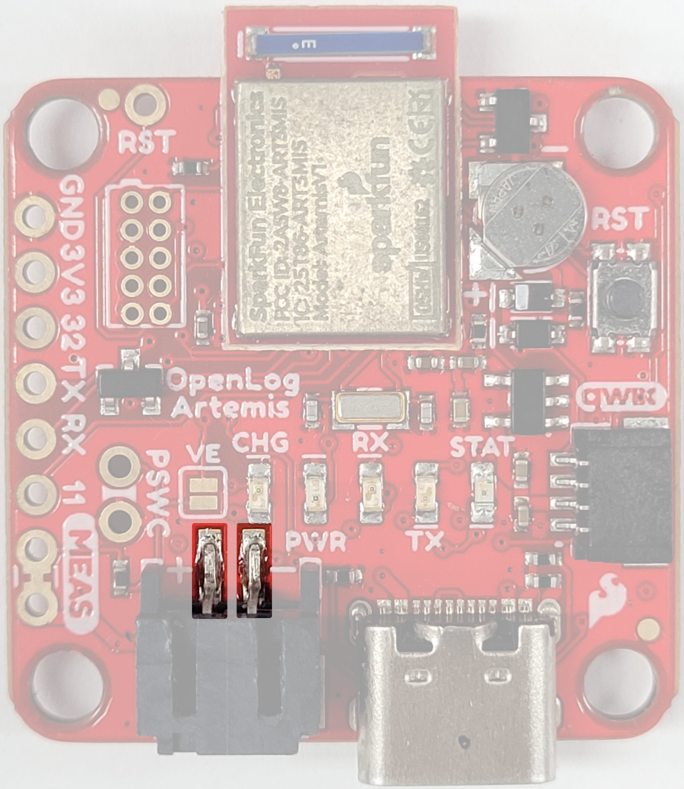
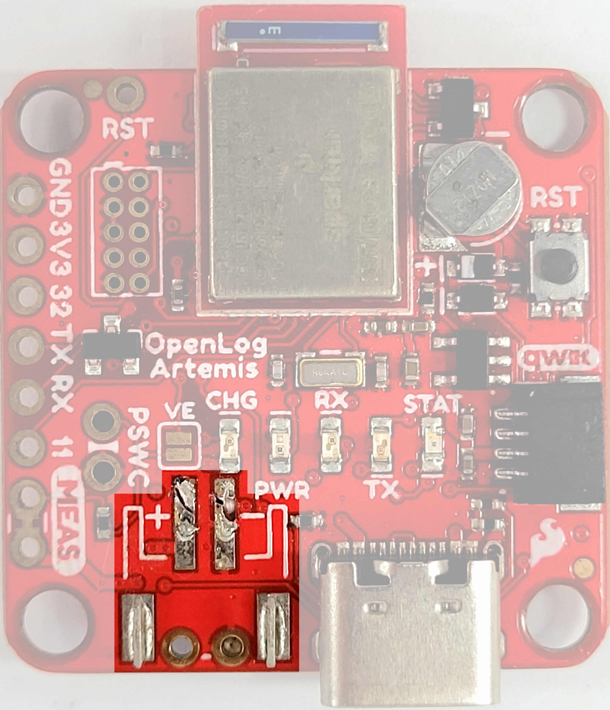
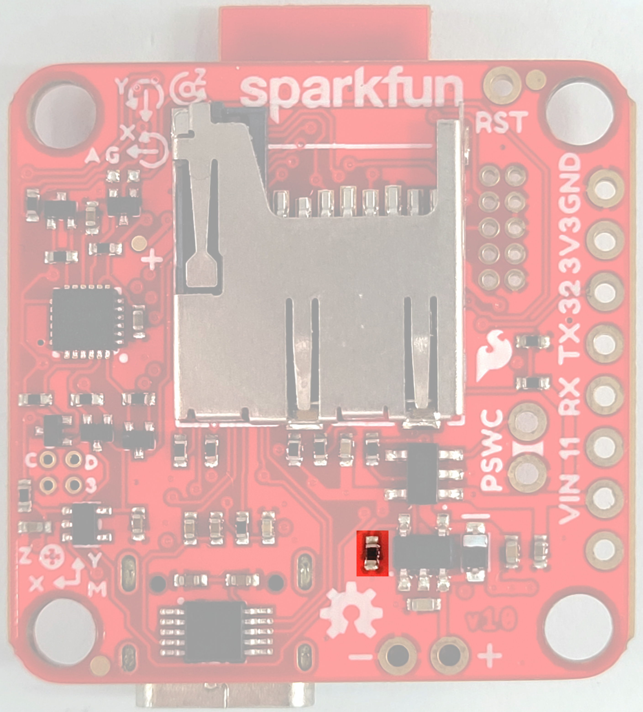
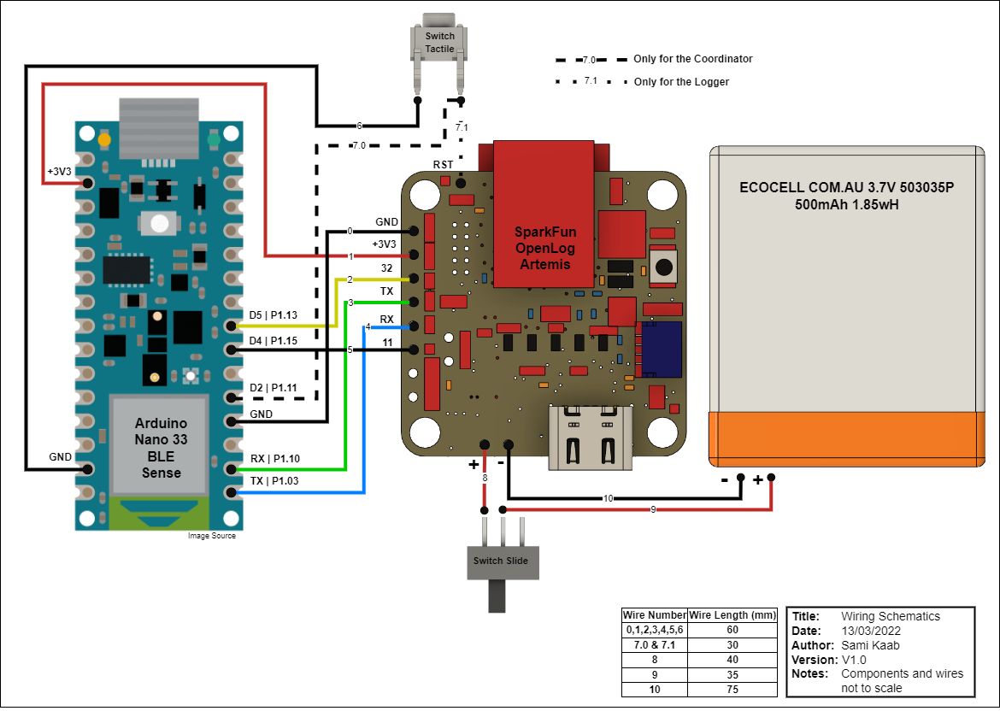

<a name="readme-top"></a>

# WMORE
This project aims at providing an opensource platform for synchronised inertial measurements.
This platform consist of a list of required components, firmware to run the components and a software user interface. 

The project comprises two types of sensors: a logger and a coordinator. The coordinator is responsible for initiating and stopping the recording on the loggers while ensuring that they remain synchronized. Only one coordinator is required to operate a group of loggers.
## Table of Content
- [WMORE](#wmore)
  - [Table of Content](#table-of-content)
- [Hardware](#hardware)
  - [Required components](#required-components)
  - [Building the device](#building-the-device)
- [Firmware](#firmware)
  - [Openlog Artemis (OLA)](#openlog-artemis-ola)
    - [Setting up the Arduino environment](#setting-up-the-arduino-environment)
    - [Uploading firmware onto the OLA](#uploading-firmware-onto-the-ola)
  - [Nano (OLA)](#nano-ola)
    - [Uploading firmware to Nano](#uploading-firmware-to-nano)
- [Software](#software)
# Hardware
## Required components
---
This project was designed using the following components. Only the Arduino Nano and Artemis Openlog are required to run the firmware, the battery and switches can be swapped for different models. However the CAD models for the case will need to be modified or redesigned accordingly if you choose to do so. The following list of materials is required for each WMORE. At least 2 WMOREs must be assembled:

 * [Arduino Nano ble 33 (Sense)](https://store.arduino.cc/products/arduino-nano-33-ble-sense)
 * [SparkFun OpenLog Artemis](https://www.sparkfun.com/products/16832)
 * [Slide switch](https://www.digikey.com.au/en/products/detail/c-k/OS102011MS2QN1/411602)
 * [Tactile Switch](https://www.digikey.com.au/en/products/detail/te-connectivity-alcoswitch-switches/1825910-6/1632536)
 * [LiPo Battery 500mAh 3.7V 503035](https://ecocell.com.au/product/lipo-500-503035/)
 * <span style="color:orange">x mm</span> of 30 AWG hook up wire
 * A [4.7kΩ 0402 surface mount resistor](https://www.digikey.com.au/en/products/detail/panasonic-electronic-components/ERA-2AEB472X/1706021)


<p align="right">(<a href="#readme-top">back to top</a>)</p>

## Building the device
---
Before wiring the components together, the Openlog Artemis must be modified in 2 ways:
1. First the JST connector needs to be removed, in order for the Openlog to fit in the case. The battery will directly be wired to the pins underneath it. To do so the two surface mount pins of the JST conenctor shown on [Figure 2](/Documentation/OpenLog_JST_Desolder_Location.jpg) must be desoldered and the JST connector slid off its rails shown on [Figure 3](/Documentation/OpenLog_JST_Desoldered.jpg) (slide the conenctor towards the center off the board).
  

2. The Openlog Artemis has a charge current of approximately 450 mA. The 500 mAh Ecocell 503035P that is used in the WMOREs has a recommended charge current of 100 mA. If this battery is used then the Openlog Artemis charge current must be reduced to 100 mA for safe operation.  This can be achieved by replacing the R4 resistor (which location is shown in [Figure 4.](/Documentation/Openlog_Battery_Voltage_Regulator_Resistor.jpg)) on the Openlog Artemis with a 4.7kΩ 0402 surface mount resistor.

|  |  |  |
|-|-|-|
| [Figure 2.](Documentation/OpenLog_JST_Desolder_Location.jpg) JST pins to desolder | [Figure 3.](Documentation/OpenLog_JST_Desoldered.jpg) Desoldered JST conenctor | [Figure 4.](Documentation/Openlog_Battery_Voltage_Regulator_Resistor.jpg) Location of the resistor to change |

The male JST connector on the battery also needs to be cut off.

Use the wiring diagram below solder the components together. 

|  |
|-|
| [Figure 1.](Documentation/Wiring_Diagram.pdf) WMORE Logger and Coordinator wiring Diagram |

**NOTE**: Pay attention to the wiring difference between the Coordinator and Logger

<p align="right">(<a href="#readme-top">back to top</a>)</p>

# Firmware
## Openlog Artemis (OLA)
---
The Coordinator and Logger OLA firmware applications are based on v2.3 of the Openlog Artemis application supplied by Sparkfun (https://github.com/sparkfun/OpenLog_Artemis). Both the OLA firmware applications were developed using the Openlog Artemis board support package installed on version 1.8.12 of the Arduino IDE. 

The Coordinator and Logger OLA firmware applications are predominantly written in Arduino C++, but include calls to the AmbiqSuiteSDK (mirrored by Sparkfun at https://github.com/sparkfun/AmbiqSuiteSDK). The original Openlog Artemis application has been significantly modified for the WMORE to enable synchronisation and to reduce processing delays. Some of the original functionality has been lost as a result. 

The Arduino project for the OLA can be found in the [OpenLog_Logger](Firmware/OpenLog_Logger) and [OpenLog_Coordinator](/Firmware/OpenLog_Coordinator/) folders under [Firmware](/Firmware/). 

### Setting up the Arduino environment
---
Before flashing the Openlogs the Arduino IDE must be set as follows:
- Install Arduino IDE 1.8.12 or above from: https://www.arduino.cc/en/software#future-version-of-the-arduino-ide
- Add Sparkfun URL to preferences by following the guide here: https://learn.sparkfun.com/tutorials/artemis-development-with-arduino#arduino-installation
- Install Board Support for Sparkfun Apollo3 Artemis using Board Manager by following the guide here: https://learn.sparkfun.com/tutorials/artemis-development-with-arduino#arduino-installation
- Select Redboard Artemis ATP
- Install libraries using Library Manager
    - Required: 
        
        Sparkfun 9DoF IMU Breakout – ICM-20948
    - Required but redundant (will not be needed once dead code is removed):
      - SparkFun_I2C_Mux_Arduino_Library
      - SparkFunCCS811
      - SparkFun_VL53L1X
      - SparkFunBME280
      - SparkFun_LPS25HB_Arduino_Library  
      - SparkFun_VEML6075_Arduino_Library 
      - SparkFun_PHT_MS8607_Arduino_Library 
      - SparkFun_MCP9600
      - SparkFun_SGP30_Arduino_Library 
      - SparkFun_VCNL4040_Arduino_Library 
      - SparkFun_MS5637_Arduino_Library
      - SparkFun_TMP117 
      - SparkFun_u-blox_GNSS_Arduino_Library 
      - SparkFun_Qwiic_Scale_NAU7802_Arduino_Library 
      - SparkFun_SCD30_Arduino_Library 
      - SparkFun_Qwiic_Humidity_AHT20 
      - SparkFun_SHTC3 
      - SparkFun_ADS122C04_ADC_Arduino_Library 
      - SparkFun_MicroPressure 
      - SparkFun_Particle_Logger_SN-GCJA5_Arduino_Library 
      - SparkFun_SGP40_Arduino_Library
      - SparkFun_SDP3x_Arduino_Library
      - MS5837
      - SparkFun_Qwiic_Button
      - SparkFun_Bio_Logger_Hub_Library 

### Uploading firmware onto the OLA
---
Once the Arduino IDE has been set up, open the [WMORE_Coordinator.ino](Firmware/OpenLog_Coordinator/WMORE_Coordinator.ino) file or the [WMORE_Coordinator.ino](Firmware/OpenLog_Coordinator/WMORE_Coordinator.ino). Connect the OLA to your computer, select the correct com port and press the upload button. The project may take a while to compile
<p align="right">(<a href="#readme-top">back to top</a>)</p>

## Nano (OLA)
---
The Coordinator and Logger Nano applications are written using **v2.1.0** of the **Nordic Semiconductor nRF Connect SDK** in the **Visual Studio Code** IDE and based on the **nRF Connect SDK Enhanced Shockburst (ESB)** sample applications. The nRF Connect SDK is based on the Zephyr RTOS, and Zephyr API calls are used in the WMORE applications. 

It is only necessary to install the nRF Connect SDK if you intend to modify this project. If that is the case, this link is a good starting point: [https://www.nordicsemi.com/Products/Development-software/nrf-connect-sdk]. The Documentation, Get Started, and nRF Connect Fundamentals links are particularly useful: 
[https://developer.nordicsemi.com/nRF_Connect_SDK/doc/latest/nrf/introduction.html]
[https://www.nordicsemi.com/Products/Development-software/nRF-Connect-SDK/GetStarted#infotabs]
[https://academy.nordicsemi.com/courses/nrf-connect-sdk-fundamentals/].

The nRF Connect SDK and the Zephyr RTOS involve a fairly complex structure of files and dependencies. Fully documenting this is well beyond the scope of this document. Of particular note however are several `.overlay`, `.dts`, and `.conf` files that are used to set up or check project-specific peripherals and pin mappings. For instance:

`<path_to_project>\<project_name>\boards\arduino_nano_33_ble.overlay` sets UART speed and GPIO pin mappings for the Nanos.

`<path_to_project>\<project_name>\arduino_nano_33_ble\zephyr\zephyr.dts` is a system-generated file that allows many peripheral settings to be checked.

`<path_to_project>\<project_name>\prj.conf` is a configuration file that is sometimes relevant when adding new peripherals.

<p align="right">(<a href="#readme-top">back to top</a>)</p>

### Uploading firmware to Nano
---

In order to flash the firmware to the Arduino nano, it is also necessary to install the bossac utility. An easy way to do this is to install the Arduino IDE, which should already have been done to support programming the OLA.

The WMORE Nano firmware uses the **arduino_nano_33_ble** Build Configuration. Once applications have been successfully built they can be uploaded to the Nano using this process:

- Conenct the Nano to the computer and press the white tactile twice (the orange LED should start flashing)

- Identify the path to the `zephyr.bin` file which can be found at :
  - For the Logger: [<path_to_project>/Firmware/Nano_Logger/arduino_nano_33_ble/zephyr/zephyr.bin](Firmware/Nano_Logger/arduino_nano_33_ble/zephyr/zephyr.bin)
  - For the Coordinator: [<path_to_project>/Firmware/Nano_Coordinator/arduino_nano_33_ble/zephyr/zephyr.bin](Firmware/Nano_Coordinator/arduino_nano_33_ble/zephyr/zephyr.bin)

- Open a terminal window (search cmd) in the folder where bossac.exe is located, which should be of the form: `C:\Users\<user_name>\AppData\Local\Arduino15\packages\arduino\tools\bossac\1.9.1-arduino2`

- Enter the following command line for the Coordinator: 
  ```sh
  .\bossac -d --port=<COMxx> -U -i -e -w <path_to_project>/Firmware/Nano_Coordinator/arduino_nano_33_ble/zephyr/zephyr.bin -R
  ```
  and for the Logger:
  ```sh
  .\bossac -d --port=<COMxx> -U -i -e -w <path_to_project>/Firmware/Nano_Logger/arduino_nano_33_ble/zephyr/zephyr.bin -R
  ```
  
**NOTE** : The appropriate .bin file **<path_to_project>** and **\<COMxx\>** should be substituted. The com port number can be found using the Device Manager. 

<p align="right">(<a href="#readme-top">back to top</a>)</p>

# Software

