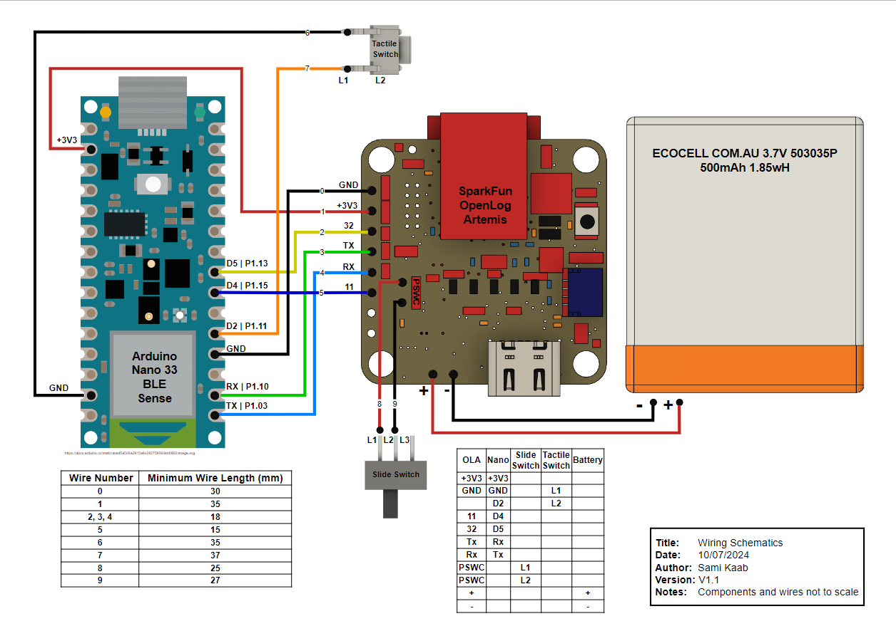

# WMORE
This project consists of 
## Table of Content
- [WMORE](#wmore)
  - [Table of Content](#table-of-content)
  - [Requirements](#requirements)
    - [Hardware](#hardware)
      - [Required components](#required-components)
## Requirements
### Hardware
#### Required components
This project was designed using the following components. Only the Arduino Nano and Artemis Openlog are required to run the firmware, the battery and switches can be swapped for different models. However the CAD models for the case will need to be modified or redesigned accordingly if you choose to do so.
 * [Arduino Nano ble 33 (sense)](https://store.arduino.cc/products/arduino-nano-33-ble-sense)
 * [Artemis Openlog](https://www.sparkfun.com/products/16832)
 * [Slide switch](https://www.digikey.com.au/en/products/detail/c-k/OS102011MS2QN1/411602)
 * [Tactile Switch](https://www.digikey.com.au/en/products/detail/te-connectivity-alcoswitch-switches/1825910-6/1632536)
 * [LiPo Battery](https://ecocell.com.au/product/lipo-500-503035/)

Use the wiring diagram below. **NOTE** Pay attention to the wiring difference between the Coordinator and Logger

The wiring diagram above is included [here](Documentation/Wiring_Diagram.pdf)

(<a href="#readme-top">back to top</a>)
